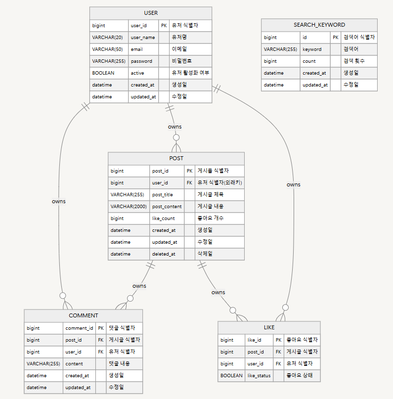
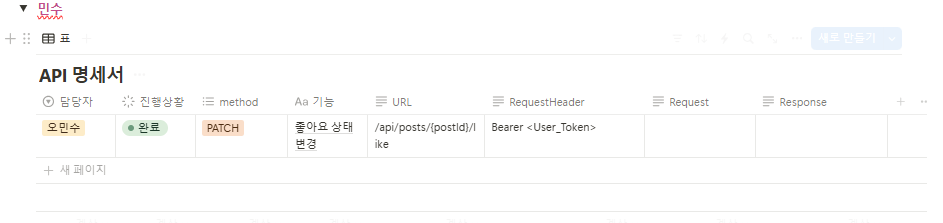
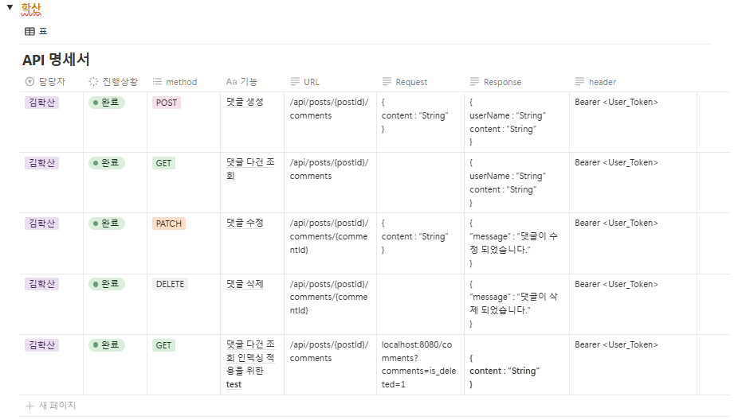
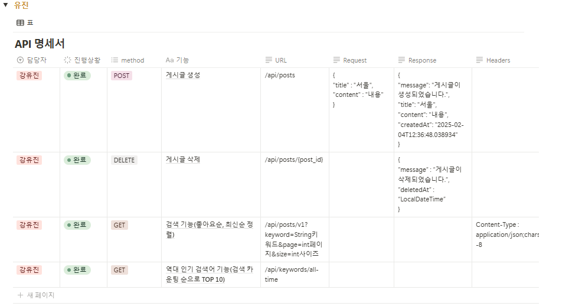
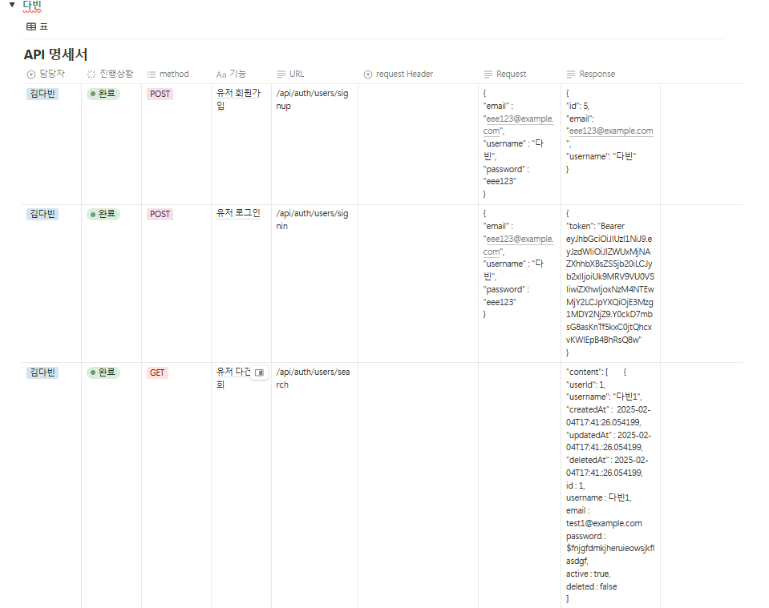
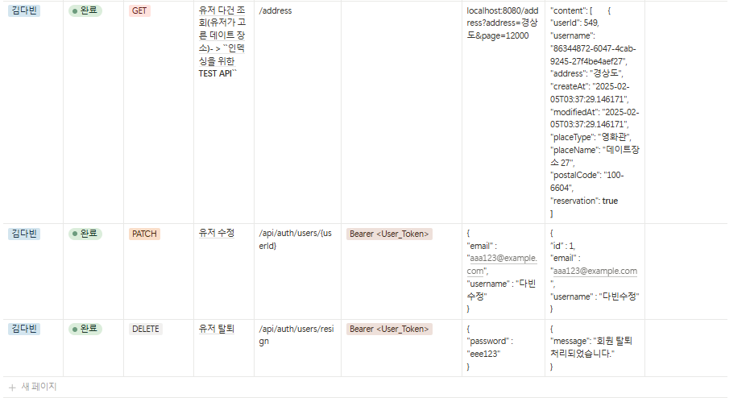
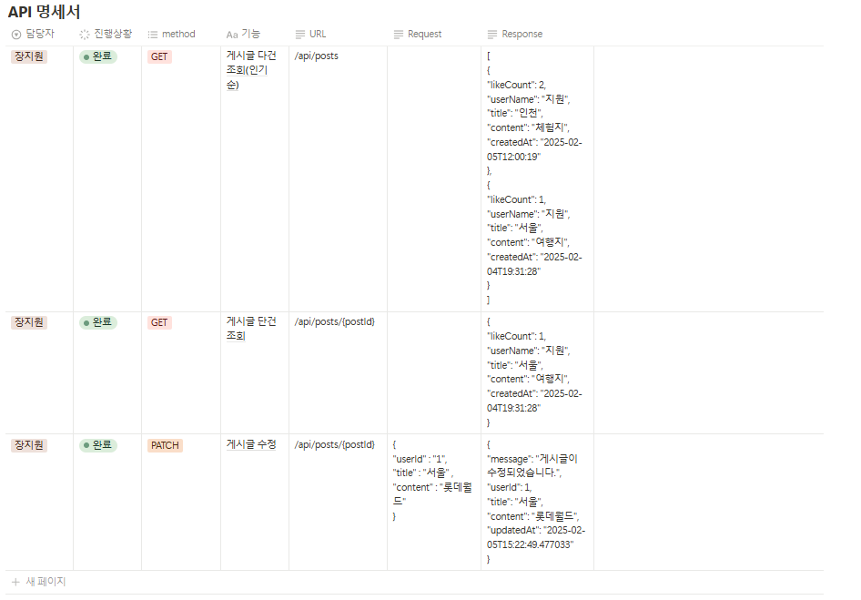

# [Spring 4기] 플러스 프로젝트

#  DATE PICK
** DATE PICK**은 알맞은 데이트 장소 순위를 살펴볼 수 있는 데이팅 앱 입니다.
게시글을 통해 데이팅 코스를 공유하고, 유저들과 편히 소통할 수 있습니다.


-  🫴 [소개]
   -  🗃️ [와이어 프레임]
   -  📊 [ERD]
   -  🌐 [API 명세]
   -  ⚠️ [Cache를 이용한 성능개선 프로젝트 (난이도 중)]
   -  ⚠️ [검색 API 성능 개선을 위한 In-memory Cache 적용]
   -  ⚠️ [최적화(Indexing)]
   -  😼 [후기]
---
<br/>

<a id="introduce"></a>
## 🫴 Introduce

### 팀명 :  DATE PICK(Team.1)
### 팀 소개 : 데이트 관련 전문 앱을 만들어 보자 하며 모인 팀.

[팀 노션 구경하러 가기](https://teamsparta.notion.site/DATE-PICK-Team-1-f795e00106e4436d8bf4cc2a0d82be0a)

---
## 1. 프로젝트 (와이어 프레임, ERD, API 명세)
#### (1) 와이어 프레임

#### (2) E-R Diagram

#### (3) API 명세





 
---
## 2. Cache을 이용한 성능개선 프로젝트 (난이도 중)
### 필수 구현 기능
### 1. 인기검색어 기능/ 검색기능 : 구현 완료
```java
// keywordService.java

// 역대 인기 키워드(검색어) 조회 API
	// DB에서 검색어 TOP 10을 가져와 순위, 응답 메시지와 함께 반환
	public SearchKeywordListResponseDto getTop10SearchKeywords() {
		// DB에서 인기 키워드 TOP 10 가져옴.
		List<SearchKeyword> top10Keywords = keywordRepository.findTop10ByOrderByCountDesc();

		// 인기 키워드에 순위 부여, SearchKeywordResponseDto로 변환
		/* [0]부터 [top10Keywords.size() - 1]까지 연속된 정수 스트림(인덱스 리스트) 생성
		 * i(인덱스)를 사용해 top10Keywords 리스트에서 i번째 데이터를 가져옴.
		 * [i + 1]을 순위로 사용해 SearchKeywordResponseDto 객체 생성.
		 * toList(): 스트림을 리스트 형태로 변환하여 반환
		 */
		List<SearchKeywordResponseDto> keywordList = IntStream.range(0, top10Keywords.size())
			.mapToObj(i -> new SearchKeywordResponseDto(i + 1, top10Keywords.get(i)))
			.toList();

		// SearchKeywordListResponseDto에 답아 응답 메시지와 함께 반환
		return new SearchKeywordListResponseDto(keywordList);
```
### 2. CRUD : 구현완료
   - 각 파트별로 user,post,comment,like에 해당하는 CRUD 구현 완료
### 3. 검색 API 에 In-memory Cache(Local Memory Cache) 적용 : 구현 완료
```java
// 인메모리 캐시 적용
// PostController.java
	@Cacheable(value = "searchCache", key = "#keyword + '-' + #page + '-' + #size")
	@GetMapping("/v2")
	public ResponseEntity<Page<FindPostResponseDto>> searchPostAPIV2(
		@RequestParam(required = false) String keyword,
		@RequestParam(defaultValue = "1") int page,
		@RequestParam(defaultValue = "10") int size
		) {
		Page<FindPostResponseDto> foundPostV2 = postService.searchPostService(keyword, page, size);
		return ResponseEntity.ok(foundPostV2);
	}
```

### 4. 검색 API 성능 개선을 위한 In-memory Cache 적용
##### 1. 개요
 본 프로젝트에서는 게시글 검색 API의 성능을 개선하기 위해 In-memory Cache(Local Memory Cache)를 
  적용. 기존 검색 API는 대량의 데이터를 조회할 때 속도가 느려지는 문제가 있었으며, 
  이를 해결하기 위해 spring-boot-starter-cache와 @Cacheable을 활용하여 캐시를 적용.

##### 2. 검색 API 성능 테스트 및 결과

JMeter를 사용하여 성능 테스트를 수행하였으며, 테스트 환경 및 결과는 다음과 같음.


#### 테스트 환경
- 데이터량 : 약 270만 건
- 테스트 요청 수 : 30회
- 요청 방식 : GET /api/v1/board/search?keyword=테스트&page=1&size=10,
- -GET /api/v2/board/search?keyword=테스트&page=1&size=10

#### 성능 비교 결과
| 구분       | 캐시 미적용 | 캐시 적용 |
  |----------|--------|-------|
  | 처리량      | 1.7건/초   | 4.3건/초  |
  | 평균 응답 속도 | 14,162ms  | 3ms |

#### 3. 검색 API에 Cache를 적용한 이유
- 3.1 검색 API의 주요 특징
- 대부분의 검색 요청은 동일한 키워드와 페이지 정보를 포함하여 반복적으로 요청됨
- 실시간 데이터 변경보다는 조회 요청이 빈번하게 발생함
- 대량의 데이터에서 빠른 검색이 필요함
- 3.2 캐시 적용의 필요성
- 데이터베이스 부하 감소: 반복적인 검색 요청이 많아 DB 부하가 높았음
- 검색 속도 향상: 동일한 요청이 발생할 때 DB 조회 없이 캐시에서 즉시 응답 가능
- 사용자 경험 개선: 평균 응답 시간이 14초에서 3ms로 대폭 단축됨
#### 4. 캐시 방법 적용
- 검색 API 코드 변경
```java
   // 캐시 미적용
@GetMapping("/v1")
public ResponseEntity<Page<FindPostResponseDto>> searchPostAPI(
	@RequestParam(required = false) String keyword,
	@RequestParam(defaultValue = "1") int page,
	@RequestParam(defaultValue = "10") int size
) {
	Page<FindPostResponseDto> foundPost = postService.searchPostService(keyword, page, size);
	return ResponseEntity.ok(foundPost);
}

// 캐시 적용
@Cacheable(value = "searchCache", key = "#keyword + '-' + #page + '-' + #size")
@GetMapping("/v2")
public ResponseEntity<Page<FindPostResponseDto>> searchPostAPIV2(
	@RequestParam(required = false) String keyword,
	@RequestParam(defaultValue = "1") int page,
	@RequestParam(defaultValue = "10") int size
) {
	Page<FindPostResponseDto> foundPostV2 = postService.searchPostService(keyword, page, size);
	return ResponseEntity.ok(foundPostV2);
}
   ```
- 캐시 설정
```java
@EnableCaching
@Configuration
public class CacheConfig {
@Bean
public CacheManager cacheManager() {
return new ConcurrentMapCacheManager("searchCache"); // 인메모리 캐시 설정
}
}
   ```
5. 결론
- 검색 API에 In-memory Cache를 적용함으로써 처리량(TPS)이 약 2.5배 증가하고, 응답 속도가 약 4,700배 단축됨.
  이러한 성능 향상은 데이터베이스 부하를 줄이고 사용자 경험을 개선하는 데 기여함.

- 따라서, 조회 빈도가 높고 변경이 적은 API에서는 캐시를 적용하는 것이 효과적인 성능 최적화 방법이 될 수 있음.

---

### 필수 구현 기능

- [x]  **인기 검색어 기능 및 검색기능이 필요한 CRUD Application 기획 및 개발**
    - **인기 검색어 기능이 포함되어 있어야한다! (아래 요구사항 참고)**
        - 인기 검색어 조회 API 를 이용해 인기 검색어 목록을 조회할 수 있는 API
    - **단, 검색기능이 포함되어 있어야한다! (아래 요구사항 참고)**
        - 특정 컬럼을 기준으로 `LIKE` 조건을 통해 검색하는 API
            - JPA, QueryDSL 사용가능, 최종적으로 발생하는 SQL 쿼리문이 `LIKE` 구문이 들어가야함
        - Paging 처리를 통해 검색 API 에서 결과를 페이지 단위로 조회


- [x]  **앞서 개발한 검색 API 에 In-memory Cache(Local Memory Cache) 적용**
    - `spring-boot-starter-cache`  의존성을 이용하고 Spring AOP 방식으로 동작하는 `@Cacheable`  어노테이션을 활용해 구현할 것
    - 기존 API 를 지우는 것이 아닌 새롭게 v2 API 를 추가
    - **총 2개의 검색 API 가 존재해야한다.**
        - v1 API 는 기존에 Cache 가 적용되지 않은 API 이고, (`/api/v1/board/search` )
          기본적으로 v2는 Local Memory Cache가 적용되어야함
          → 선택 구현 기능을 구현한다면 v2의 Local Memory Cache를 Redis를 이용하기.
          (`/api/v2/board/search` )
    - **왜 검색 API 에 Cache 를 적용했는지 스스로 꼭!! 고민하고 Readme 작성.**
    - 검색 API 가 아니더라도 Cache 를 적용할만한 포인트가 있다면 함께 적용해보자.
        - 단, 해당 포인트에 왜(Why!?) Cache 를 적용했는지 설명할 수 있어야한다.
      
---
## 도전 기능 가이드
### 최적화(Indexing)
**요구사항**

- 검색 속도를 향상시키기 위해 적절한 인덱스를 설계해주세요.
- 자주 사용되는 조건에 맞는 컬럼에 인덱스를 적용하여 대용량 데이터에서도 빠른 검색을 지원하세요.

**해결**
- 유저와 댓글 부분에 인덱싱 설계를 구현하여 문제를 해결 하였습니다.
  - 유저 인덱싱 설계 :
  [Click here to try](https://www.notion.so/teamsparta/DATE-PICK-Team-1-f795e00106e4436d8bf4cc2a0d82be0a?pvs=4#6dac0c89086c4cd494b166cf0c349161)

  - 댓글 인덱싱 설계 :
  [Click here to try](https://www.notion.so/teamsparta/DATE-PICK-Team-1-f795e00106e4436d8bf4cc2a0d82be0a?pvs=4#03c940cc80524fb1ac5dff7efde7de1f)

---
## 😼 후기
- 민수 : 언제나 협업은 소통이 중요하다고 생각했으나 이번 프로젝트를 하면서 더욱 크게 와닿았던 거 같습니다 최종때는 조금 더 나서서 소통을 주도 할 수 있도록 최선을 다해볼 예정입니다.
- 학산 : 이번 프로젝트에서 인덱싱, JWT 적용 등 처음으로 적용해 본 기능이 많았는데 팀원들과 협업 및 문제를 해결 할 수 있어 좋은 경험이 되었습니다! 
- 유진 : post 생성 및 삭제와 인기검색어(캐싱)를 구현하면서 심도있게 학습할 수 있어서 뜻깊었고, 팀원들과의 협업의 중요성도 한 번 더 느꼈습니다.
- 다빈 : 로그인 구현부터 인덱싱까지 여러 인사이트들을 얻고 가는 것 같아 값진 경험이었다. 협업의 과정에서 얻는 배움도 많았습니다. 고생하셨어요 1조!
- 지원 : 이번 팀 프로젝트에서 토큰을 처음 적용해보고 인메모리 캐싱을 학습할 수 있는 경험을 할 수 있어서 좋았습니다.
---
